# Architecture

```mermaid
flowchart LR
    user[User / Browser]

    subgraph frontend[Next.js frontend]
        proxy[HTTP Basic proxy]
        ui[Server Components and UI]
        action[Generation Server Action]
        client[Server-only backend client]

        proxy --> ui
        ui --> action
        ui --> client
        action --> client
    end

    subgraph backend[FastAPI backend]
        api[Versioned JSON API<br/>/api/v1]
        auth[HTTP Basic authentication]
        validation[Pydantic validation]
        limiter[Per-user fixed-window<br/>rate limiter]
        service[GenerationService protocol]
        provider[Deterministic demo provider<br/>or production LLM adapter]

        api --> auth
        auth --> validation
        validation --> limiter
        limiter --> service
        service --> provider
    end

    user -->|HTTPS request with Basic Auth| proxy
    client -->|Server-to-server HTTP<br/>Authorization forwarded| api
    provider -->|Provider-neutral generation response| client
    client -->|Rendered metadata or action result| ui

    config[Server-only environment<br/>backend URL, credentials, timeouts]
    config -.-> proxy
    config -.-> client
    config -.-> api
```

The browser never calls FastAPI directly. Next.js revalidates the incoming Basic
Auth header at protected server boundaries and forwards it through the private
backend client. FastAPI authenticates protected routes, validates requests, and
rate-limits generation calls before invoking the configured provider. The health
endpoint is public; configuration and generation endpoints require authentication.
